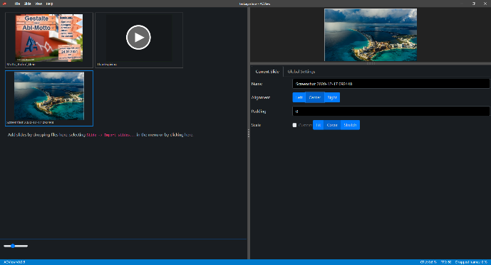

# AGView

AGView is a video player for events. What's the difference to a normal video player like VLC Player you may ask? AGView offers the following features:
- Separate Projector (Output Windows)
- Multiple Projectors
- Projector Padding and Background colors
- Autohide cursor
- View your system stats in the statusbar
- custom aspect ratios
- Videos / Images (called slides) list
- Align / Scale slides which don't fit perfectly
- and **nice Transitions** between the slides!

With that, you can create a great experience for the viewer which will never see your desktop or any other windows.

## Usage
Go to the [Releases](https://github.com/hrueger/AGView/releases), download the latest version, install it like any other software and run it!

## Known limitations
- Audio output is not working ([#34](https://github.com/hrueger/AGView/issues/34))

## Development
1. Clone the reporitory using `git clone https://github.com/hrueger/AGView`
2. Install dependencies with `npm i`
3. Start your dev session using `npm start`
Have fun!

## License
MIT